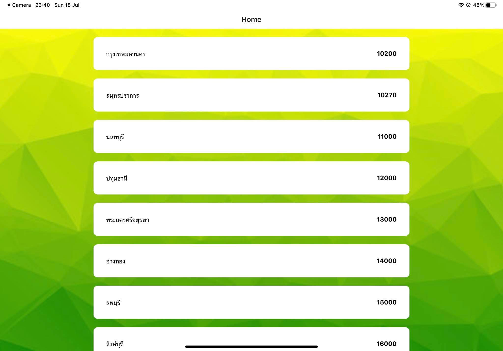

# นาย จิรเมธ ติวงค์ รหัส 6210110047 sec   01

- ปรับเปลี่ยน layout ของหน้า home ให้มีความเป็น clickable
- ปรับเปลี่ยนหน้า weather ให้มีความสวยงามมากขึ้น
- เพิ่มตัวแปรชื่อจังหวัดของรหัสไปรษณีย์นั้น ค่า feels like และ icon แสดงสภาพอากาศ มาแสดงทั้งหมด
- ทำการดึง list ของจังหวัด - เลขไปรษณีย์ ในประเทศไทย มาทำเป็น list ให้เลือกเข้าไปดู infomation

** หมายเหตุ ตอน build ครั้งแรกจะไม่เห็น list ต้องทำการกดเซฟไฟล์เพื่อให้ทำการ fetch ข้อมูลใหม่อีกครั้ง เพื่อแสดง และเลขรหัสไปรษณีย์ที่กดเข้าไปกับชื่อจังหวัดอาจจะไม่ตรงกัน - ไม่พบข้อมูล เนื่องจาก list ของ zip code เอามาจาก api นอก และ ทำการ filter เอา ชื่อจังหวัดที่ซ้ำกันออก ทำให้ ข้อมูลอาจไม่ตรงกัน

